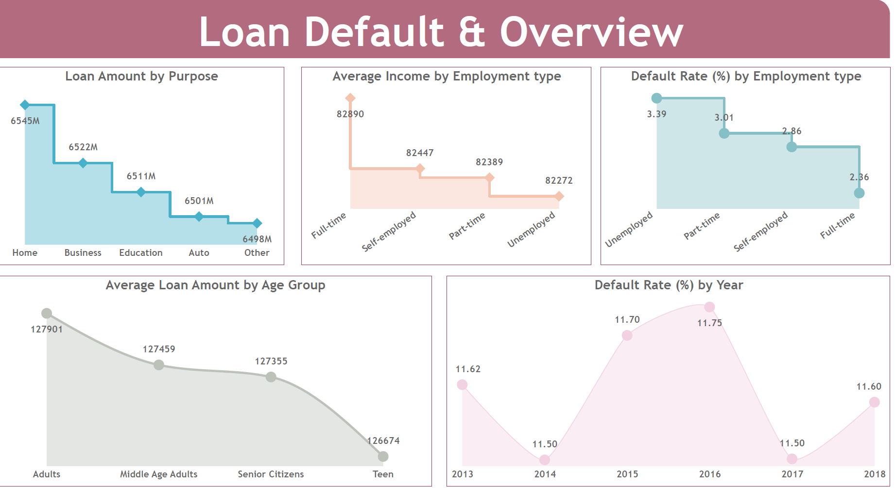

# Loan Default Analysis Project

## Overview
This project analyzes loan default rates and applicant demographics using financial data. The dataset includes metrics such as loan amounts by purpose, average income by employment type, default rates by various categories, and detailed financial profiles of applicants.

## Key Metrics

### Loan Default & Overview (Page 1)
- **Loan Amount by Purpose**:  
  - Home, Business, Education, Auto, Other (values in millions).  
- **Average Income by Employment Type**:  
  - Full-time, Self-employed, Part-time, Unemployed.  
- **Default Rate by Employment Type**:  
  - Highest among the unemployed (3.39%), lowest among the self-employed (2.86%).  
- **Average Loan Amount by Age Group**:  
  - Adults, Middle Age Adults, Senior Citizens, Teen.  
- **Default Rate by Year (2013-2018)**:  
  - Fluctuations observed, with the highest rate in 2014 (11.75%).  

### Applicant Demographics & Financial Profile (Page 2)
- **Median Loan Amount by Credit Score Category**:  
  - Medium, Low, Very Low.  
- **Average Loan Amount (High Credit) by Age and Marital Status**:  
  - Detailed breakdown for Single, Divorced, Married applicants across age groups.  
- **Total Loan Amount by Credit Score Bins**:  
  - Adults: 4.5bn (Medium), 4.6bn (High), 1.1bn (Very Low).  
- **Number of Loans by Education Type**:  
  - Bachelor’s (64,368), High School (63,903), Master’s (63,541), PhD.  

### Financial Risk Metrics (Page 3)
- **Year-over-Year (YOY) Changes**:  
  - Loan Amount: Fluctuations between -1.53% and +1.73%.  
  - Default Loans: Peaked in 2015 (+2.7%), declined in 2016-2017.  
- **YTD Loan Amount by Credit Score and Marital Status**:  
  - Divorced: 32.58bn (High Income), Married: 21.73bn (Medium Income).  

## Data Sources
- The analysis is based on a dataset visualized in Power BI Desktop, covering loan and demographic details from 2013 to 2018.

## Usage
1. **Explore Trends**: Use the metrics to identify patterns in loan defaults, income, and credit scores.  
2. **Risk Assessment**: Analyze default rates by employment type, age, or credit score to assess financial risk.  
3. **Comparative Analysis**: Compare loan amounts across education levels or marital status for deeper insights.  

## Notes
- All monetary values are in the dataset's native units (e.g., millions/billions where specified).  
- Default rates are percentages; loan amounts may require scaling for precise interpretation.  

For further details, refer to the Power BI report or raw data source.
